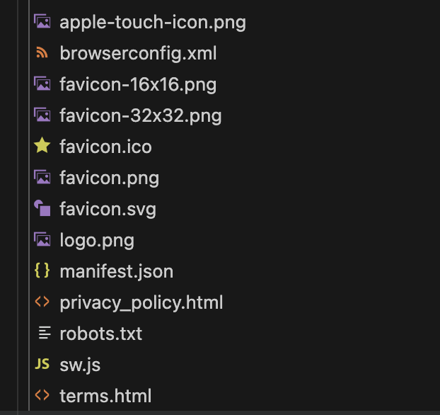
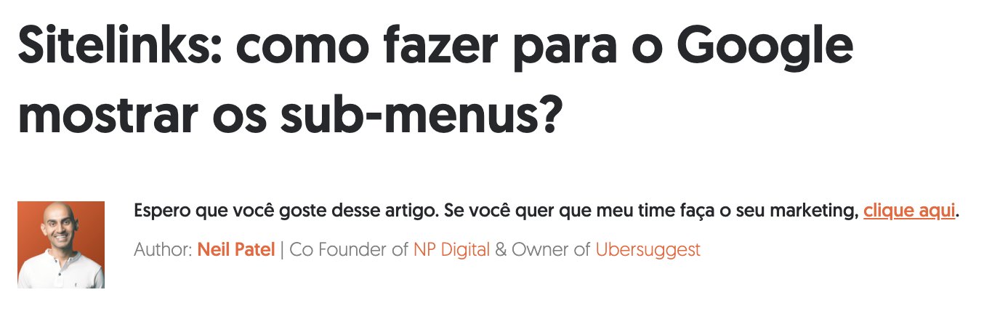

# Backog

- mais padding right left na imagem principal do artigo

- preciso arrumar isso aqui no artigo depois que criar esse artigo: 👉 [Link para o Artigo de Casos de Sucesso]

- Criar model artigos relacionados

- como incluir isso em algum lugar para facilitar quando for criar uma imagem e um link no article?

 🔗 **Acesse o site oficial para consultar seu status** <a href="https://ceac.state.gov/CEACStatTracker/Status.aspx" target="_blank">aqui ↗</a>

- Criar model discussion???

 ./helper.sh (option 1)
 npx prisma db pull
 npx prisma generate

 node generate-blog-content.js fastvistos
 npm run download-images:fastvistos
 npm run build:fastvistos
 node deploy-site.js fastvistos

## To Do

- tentar resolver o problemas que lighthouse aponta

- run node generate-blog-content.js fastvistos when running npm run build:fastvistos to avoid errors

- colocar author e foto no final de cada artigo

- put some right/left padding in faq when in mobile mode

- create these ids  like logoId and others in one place  to be shared

- maybe I want change to the convention buut necessary: "@id": "https://neilpatel.com/br/#/schema/logo/image/",

- Review publishing steps
 ./helper.sh (option 1)
 npx prisma db pull
 npx prisma generate
 node generate-blog-content.js fastvistos
 npm run download-images:fastvistos
 npm run build:fastvistos
 node deploy-site.js fastvistos

- por enquanto não vou pemitir publicar o original e se a pessoa quiser voltar para o original terá que clonar o original e publicar

- Missing seo stuff, all jsonLd files.

---

- Imagem no artigo?

Criar um modelo para anexar imagens de um blog? Isso não vai sobrecarregar a minha vps? Soluções alternativas?

---

- Criar um blog editor em microservicesadm com todas as md tags (ele pode arrastar esses tags) e conforme o usuario vai escrevendo o artigo, ele já vê o formato real como vai ficando e pode de lá mesmo pegar imagens e mandar para o servidor.

---

- Facilitar e se possível automatizar a criação de todos esses arquivos, ver image.

---

- Criar campo Author default em blog_conf e campo imagem author
- Criar campo author default em topic e campo imagem
- Permitir colocar author diferente no article caso seja outro além de Author default de blog_conf e topic

---

- flag de conf para exibir data ou não no artigo
- call to action do lado da foto do author no início do article. Achei interessante, veja:

Espero que você goste desse artigo. Se você quer que meu time faça o seu marketing, clique aqui.

---

- Implementar possibilidade de adição de comentários e criar endpoints and modelos para isso na base de dados.

---

- Criar no blog_config model um campo para o sidebar (aside) do article?

Coisas que vão:

- Call-to-action (CTA) (e.g., "Do you want more traffic?" with a form)
- Table of contents (navigational aid)
- Advertisements, promotions, or related links

**Pensando se crio um campo ou se uso o campo existente json de conf?**
**também quero misturar a possibilidade de fazer customizações direto no código**

---

## Completed

- publicar para testar e documentar os passos

---

Missing footer at home page and whasapp links not working.

---
