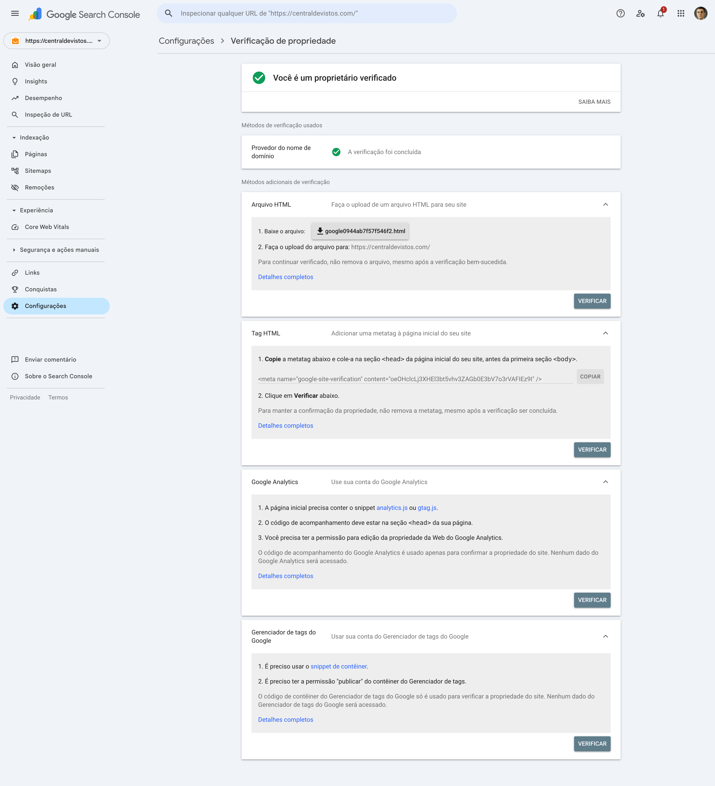
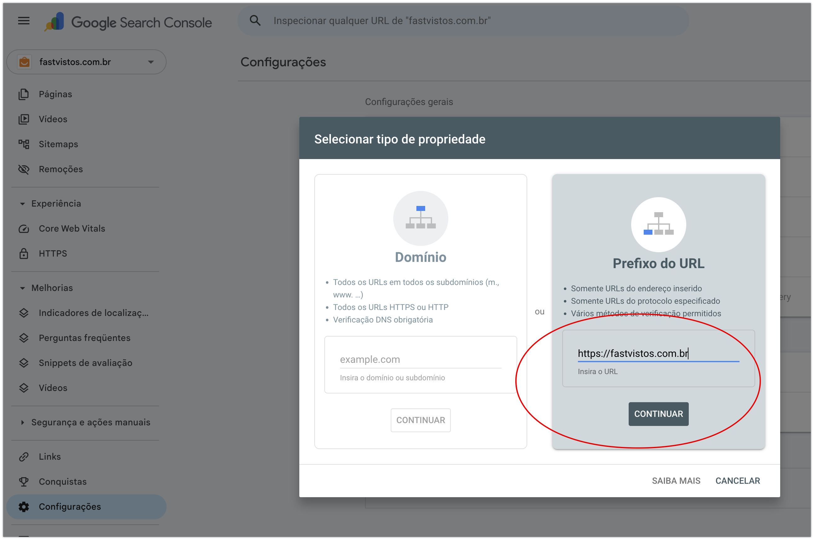

# Tutorial: Configurar Google Search Console e Sitemap

Este tutorial cobre o processo completo de configuração do Google Search Console (GSC) para um novo site, incluindo verificação de propriedade, obtenção do código de meta tag e submissão do sitemap.

---

## Parte 1 — Adicionar o site no Google Search Console

### Passo 1: Acessar o GSC

Acesse [search.google.com/search-console](https://search.google.com/search-console) e faça login com sua conta Google.

### Passo 2: Adicionar nova propriedade

No canto superior esquerdo, clique na seta ao lado do nome da propriedade atual → clique em **"Adicionar propriedade"**.

### Passo 3: Escolher o tipo de propriedade

Vai aparecer uma tela com duas opções:

| Opção | Quando usar |
|---|---|
| **Domínio** | Cobre todas as variações (www, sem www, HTTP, HTTPS). Verificação obrigatória via DNS. |
| **Prefixo do URL** | Cobre apenas a URL exata digitada. Permite múltiplos métodos de verificação. |

**Escolha "Domínio"** para a configuração principal — ele cobre `centraldevistos.com`, `www.centraldevistos.com`, HTTP e HTTPS de uma vez só.

Digite apenas `centraldevistos.com` (sem https://) e clique em **Continuar**.

### Passo 4: Verificar via DNS

O GSC vai exibir um código TXT para adicionar no DNS do seu domínio. Copie o código e adicione-o como um registro TXT no painel do seu provedor de domínio (Registro.br, Cloudflare, GoDaddy etc.).

Após adicionar, volte ao GSC e clique em **Verificar**. Quando aparecer **"Você é um proprietário verificado"** com o ícone verde, a configuração principal está concluída.

> **Nota:** O registro TXT deve permanecer no DNS permanentemente. Removê-lo cancela a verificação.

---

## Parte 2 — Obter o código de verificação para meta tag



Mesmo com o domínio verificado via DNS, pode ser necessário adicionar a meta tag `google-site-verification` no código do site (por exemplo, em um `siteConfig`). Para isso:

### Passo 1: Adicionar propriedade por Prefixo do URL

Clique novamente na seta no canto superior esquerdo → **"Adicionar propriedade"** → escolha **"Prefixo do URL"** → digite `https://centraldevistos.com` → clique em **Continuar**.



### Passo 2: Localizar o código da Tag HTML

Vá em **Configurações** no menu lateral → **Verificação de propriedade** → role até a seção **"Tag HTML"**.

Você vai ver a meta tag completa:

```html
<meta name="google-site-verification" content="SEU_CODIGO_AQUI" />
```

Copie apenas o valor do atributo `content`.

### Passo 3: Adicionar no código do site

No seu projeto Astro, adicione o valor no `siteConfig`:

```js
verification: {
  googleSiteVerification: "SEU_CODIGO_AQUI"
}
```

O componente no `<head>` já cuida do resto:

```astro
{
  siteConfig.verification?.googleSiteVerification &&
    siteConfig.verification.googleSiteVerification.trim() !== '' && (
      <meta
        name="google-site-verification"
        content={siteConfig.verification.googleSiteVerification}
      />
    )
}
```

### Passo 4: Verificar

Após subir o código em produção, volte ao GSC em **Configurações → Verificação de propriedade → Tag HTML** e clique em **Verificar**.

---

## Parte 3 — Corrigir o sitemap

Antes de submeter o sitemap, é preciso garantir que ele esteja correto. Dois problemas comuns:

### Problema 1: URLs com `undefined`

As URLs do sitemap aparecem como `https://undefined/caminho` em vez do domínio real. Isso acontece quando a variável de ambiente com a URL base não está sendo lida no build.

**Correção:** Verifique o arquivo de configuração do gerador de sitemap (ex: `next-sitemap.config.js`, `astro.config.mjs`) e garanta que a variável de ambiente está definida:

```js
// next-sitemap.config.js
module.exports = {
  siteUrl: process.env.SITE_URL || 'https://centraldevistos.com',
}
```

E no `.env`:
```
SITE_URL=https://centraldevistos.com
```

Se o build roda em CI/CD (GitHub Actions, Vercel, Netlify), configure a variável de ambiente também no painel da plataforma.

### Problema 2: Content-Type errado

O servidor serve os arquivos `.xml` com `Content-Type: text/html` em vez de `application/xml`, fazendo validadores e o Google rejeitarem o sitemap.

**Correção no Nginx:**
```nginx
location ~* \.xml$ {
    add_header Content-Type application/xml;
}
```

**Correção no Apache (`.htaccess`):**
```apache
AddType application/xml .xml
```

---

## Parte 4 — Submeter o sitemap no GSC

Com o sitemap corrigido e o site verificado:

### Passo 1: Acessar Sitemaps

No menu lateral do GSC, clique em **Sitemaps**.

### Passo 2: Submeter

No campo **"Adicionar novo sitemap"**, digite a URL do sitemap:

```
https://centraldevistos.com/sitemap-0.xml
```

Clique em **Enviar**.

### Passo 3: Aguardar

O Google vai enfileirar as URLs para rastreamento. Para sites novos, pode levar de alguns dias a algumas semanas para as páginas aparecerem indexadas.

> **Dica:** Para acelerar a indexação das páginas mais importantes (ex: `/vistos/estados-unidos/`, `/vistos/canada/`), use a ferramenta **Inspeção de URL** no GSC e clique em **"Solicitar indexação"** manualmente para essas URLs prioritárias.

---

## Resumo do fluxo completo

```
1. GSC → Adicionar propriedade → Domínio → Verificar via DNS
2. GSC → Adicionar propriedade → Prefixo do URL → Pegar código da Tag HTML
3. Adicionar código no siteConfig do projeto
4. Corrigir variável de ambiente da URL base no sitemap
5. Corrigir Content-Type do servidor para .xml
6. GSC → Sitemaps → Submeter sitemap-0.xml
```