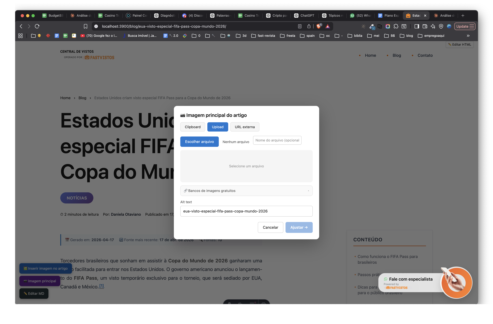

# Especificação Técnica — Blog Image Editor (Versão DEV)

## 1. Objetivo

Permitir a inserção e edição visual de imagens em artigos do blog durante o desenvolvimento local, facilitando o trabalho de editores e desenvolvedores. A feature é **injetada apenas em ambiente de desenvolvimento** (`import.meta.env.DEV === true`) e nunca vai para produção na versão atual.

---

## 2. Arquitetura e Fluxo

### 2.1. Injeção Condicional

- O script blog-image-editor.js é injetado nas páginas de artigo (ex: `/blog/[slug]`) **apenas quando em modo DEV**.
- A injeção é feita via template Astro, usando um bloco condicional que verifica `import.meta.env.DEV`.

### 2.2. Configuração

- O script recebe via `window.__BLOG_EDITOR_CONFIG__` as seguintes informações:
  - `slug` do artigo
  - `siteId`
  - `businessId`
  - `proxyBase` (base para rotas de API, respeitando proxies do Vite)

### 2.3. Pré-requisitos

- FFmpeg instalado localmente (para processamento de imagens).
- Variáveis de ambiente no .env:
  - `DJANGO_MICROSERVICESADM_KEY`
  - `DJANGO_API_BASE_URL`
  - `IMAGE_SERVICE_URL`

### 2.4. Inicialização

- Ao carregar, o script:
  - Injeta estilos customizados.
  - Renderiza placeholders de imagem no DOM.
  - Configura tracking de cliques e handler de paste.
  - Adiciona três FABs (botões flutuantes) no canto inferior esquerdo:
    1. **Inserir imagem no artigo**
    2. **Imagem principal**
    3. **Editar MD**

---

## 3. Funcionalidades

### 3.1. Inserir Imagem no Artigo

- Usuário seleciona um parágrafo, heading ou item de lista (borda azul indica seleção).
- Clica no FAB "🖼️ Inserir imagem no artigo".
- Modal abre com três abas:
  - **Upload** (arquivo local, processado via FFmpeg)
  - **URL externa**
  - **Clipboard** (imagem copiada)
- Preenche alt text e confirma.
- Imagem é salva no DB e inserida no DOM após o alvo selecionado.
- Se não houver seleção, exibe aviso.

### 3.2. Paste Rápido

- Usuário copia uma imagem e pressiona Cmd+V na página.
- Modal abre automaticamente na aba Clipboard.

### 3.3. Placeholders no Markdown

- Se o `content_md` contém `<!--[[INSERIR IMAGEM: ...]]-->`, o editor renderiza um botão laranja no lugar.
- Ao clicar, abre modal para inserir imagem e substitui o placeholder.

### 3.4. Editar Markdown

- FAB "✏️ Editar MD" abre editor de Markdown completo.
- Permite edição direta do `content_md` e salva via API.
- Banner amarelo avisa que é preciso recarregar a página para refletir mudanças.

### 3.5. Imagem Principal (Hero)

- FAB "📷 Imagem principal" abre modal para definir/cambiar a imagem principal do artigo.
- Salva apenas no campo `image` do artigo no DB, sem alterar o `content_md`.

---

## 4. APIs e Proxies

- **Proxy Vite** redireciona chamadas para:
  - `/image-editor` → Django API
  - `/image-upload` → Serviço local de imagens (Node/FFmpeg)
  - `/article-image` → API local para salvar imagem principal
- Todas as rotas são relativas ao `proxyBase` configurado.

---

## 5. Persistência e Localização dos Arquivos

- Imagens são salvas em:
  ```
  public/{siteId}/assets/images/blog/{slug}/{slug}-{timestamp}.webp
  ```
- Exemplo:
  ```
  public/centraldevistos/assets/images/blog/reverter-negativa-visto-americano/reverter-negativa-visto-americano-1712534400000.webp
  ```

---

## 6. Limitações Atuais

- **Só funciona em DEV**: nunca é injetado em produção.
- **Acesso restrito ao ambiente local**: não há mecanismo de autenticação ou links temporários.
- **Dependências locais**: FFmpeg, serviços Node e Django precisam estar rodando localmente.
- **Persistência visual vs. DB**: inserir imagem no DOM não garante persistência no Markdown/DB; é preciso salvar via editor de MD.

---

## 7. Troubleshooting

- Botões não aparecem: script não carregou.
- 401 na API: variável de ambiente não carregada.
- Upload falha: serviço de imagem não está rodando.
- Imagem some ao recarregar: não foi salva no Markdown.

---

## 8. ()

- Modal de seleção de imagem com abas (Clipboard, Upload, URL externa), preview, alt text, e botão de ajuste.
- FABs flutuantes para acesso rápido às funções principais.

---

## Seção: Link Temporário para Edição de Imagem (UUID)

### Objetivo

Permitir que um artigo do blog seja editado (inclusão de imagens e edição de Markdown) via uma URL temporária, acessível de qualquer dispositivo, válida por 10 minutos, sem necessidade de autenticação adicional.

### Diferença entre SSR Astro e Página Estática

- **SSR Astro (Server-Side Rendering):**
  - A página é gerada sob demanda pelo servidor Node (multi-sites/core/msitesapp/server.js) usando Astro como engine de template.
  - Permite buscar o artigo diretamente do banco de dados, validar UUID, expiração, e injetar scripts dinâmicos.
  - Ideal para fluxos temporários, dinâmicos e seguros.
- **Página Estática:**
  - Gerada no build e servida como arquivo HTML pronto.
  - Não permite lógica dinâmica (validação de UUID, expiração, busca no BD).
  - Não atende ao requisito de expiração e edição dinâmica.

### Fluxo de Geração e Validação do Link Temporário

1. **Geração do Link**
   - Um endpoint (ex: `/api/generate-edit-link`) recebe o slug e siteId do artigo.
   - Gera um UUID v4 e calcula o timestamp de expiração (agora + 10 minutos).
   - Salva em um arquivo temporário no servidor (ex: `tmp/edit-image-uuids.json`) com estrutura:
     ```json
     {
       "<uuid>": {
         "slug": "<slug>",
         "siteId": "<siteId>",
         "expiresAt": "2026-04-17T12:34:56.000Z",
         "inUse": false
       },
       ...
     }
     ```
   - Retorna a URL: `/edit-image-temp/<uuid>`

2. **Acesso ao Link**
   - Endpoint Express (`server.js`) recebe o UUID.
   - Lê o arquivo temporário, remove UUIDs expirados.
   - Valida se o UUID existe, não expirou e não está em uso.
   - Marca como `inUse: true` para bloquear uso simultâneo.
   - Busca o artigo no banco de dados.
   - Renderiza a página Astro com o editor de imagem injetado.
   - Se inválido/expirado/em uso, retorna página de erro adequada.

3. **Expiração e Limpeza**
   - Sempre que o endpoint é acessado, faz limpeza dos UUIDs expirados no arquivo.
   - Opcional: cron job para limpeza periódica.
   - Ao fechar a página ou após 10 minutos, marca o UUID como expirado/removido.

4. **Interface e UX**
   - Exibe contador regressivo de tempo restante (ex: banner ou timer visível).
   - Ao expirar, recarrega a página automaticamente e mostra mensagem de expiração.
   - Se tentar salvar após expirar, mostra erro e bloqueia ação.

5. **Segurança e Permissões**
   - Qualquer pessoa com o link pode editar o artigo enquanto o UUID for válido.
   - Não há autenticação extra, nem limitação de IP/user-agent.
   - Não permite edição simultânea: se o UUID estiver em uso, bloqueia novos acessos.

6. **Exemplo de Endpoint Express**
```js
// multi-sites/core/msitesapp/server.js
app.get('/edit-image-temp/:uuid', async (req, res) => {
  const { uuid } = req.params;
  // 1. Ler arquivo tmp/edit-image-uuids.json
  // 2. Limpar expirados
  // 3. Validar uuid, expiração, inUse
  // 4. Buscar artigo no BD
  // 5. Renderizar página Astro com editor injetado
  // 6. Marcar inUse: true
  // 7. Se inválido, renderizar página de erro
});
```

### Observações

- O arquivo temporário pode ser um JSON simples, carregado e salvo a cada operação.
- Para evitar corrupção, usar lock simples (ex: fs.promises com atomic write).
- O editor de imagem pode ser injetado sempre que o acesso for via UUID válido, mesmo em produção.
- O fluxo é seguro o suficiente para uso temporário, pois o UUID expira e não há indexação pública.

---
